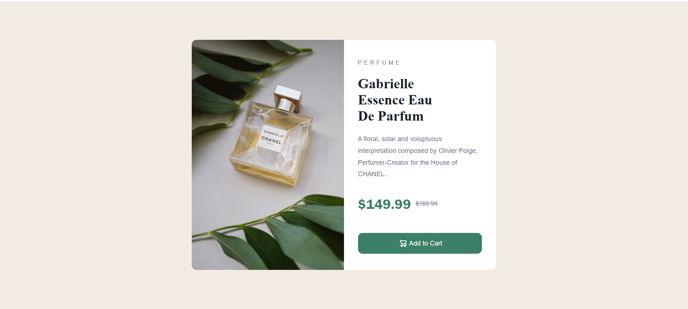

# Frontend Mentor - Product Preview Card Component Solution

This is my solution to the **Product Preview Card Component** challenge on Frontend Mentor. The goal of this project was to build a responsive product card that adapts to different screen sizes while closely matching the provided design.

## Overview

### The Challenge

Users should be able to:

- View the optimal layout depending on their device's screen size.
- See hover and focus states for interactive elements.

### Screenshot

### Links

- **Solution URL:** https://www.frontendmentor.io/solutions/your-solution-link
- **Live Site URL:** https://your-live-site-url.com

---

## My Process

### Built With

- Semantic HTML5
- CSS3
- Flexbox
- Responsive Design with Media Queries
- Custom Fonts using `@font-face`
- CSS Hover Effects
- HTML `<picture>` Element for Responsive Images

### What I Learned

While building this project, I improved my understanding of:

- Creating responsive layouts using Flexbox.
- Using Media Queries to adapt layouts for different screen sizes.
- Displaying different images for desktop and mobile using the `<picture>` element.
- Styling buttons with icons.
- Applying hover effects for better user interaction.
- Managing spacing using margin, padding, and gap.
- Working with custom fonts and typography.

### Continued Development

In future projects, I want to continue improving my skills in:

- CSS Grid
- Advanced Responsive Design
- JavaScript
- React
- Accessibility and Semantic HTML

---

## AI Collaboration

I used **ChatGPT** as a learning assistant during this project. It helped me understand responsive design, Flexbox, Media Queries, the `<picture>` element, button styling, spacing, and CSS best practices. The explanations helped me understand the concepts instead of simply copying code.

---

## Author

- **GitHub:** https://github.com/Arhamali06
- **Frontend Mentor:** https://www.frontendmentor.io/profile/Arhamali06
- **LinkedIn:** https://www.linkedin.com/in/arhamali06

---

## Acknowledgments

Thanks to **Frontend Mentor** for providing practical frontend challenges that help developers strengthen their HTML and CSS skills through real-world projects.